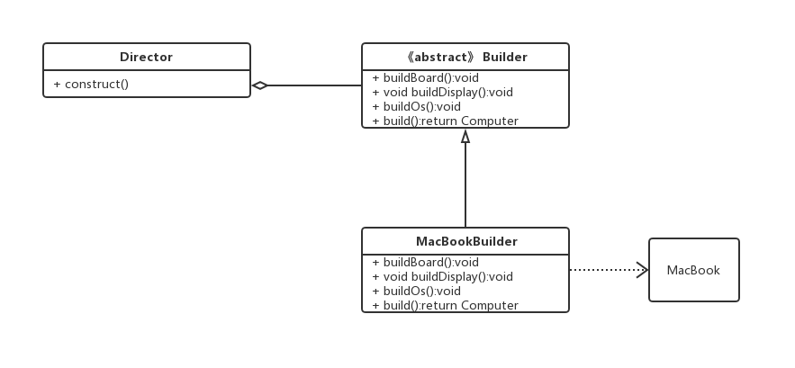

#1、定义以及 UML 建模图
将一个复杂的对象的构建与它的表示分离，是的同样的构建过程可以创建不同的表示。

#2、使用场景：
多个部件或者零件，都可以装配到一个对象中，但是产生的运行结果又相同。

产品类非常复杂，或者产品类中调用顺序不同产生了不同的作用。

初始化一个对象特别复杂，如使用多个构造方法，或者说有很多参数，并且都有默认值时。

#3
- 抽象产品类 computer
- Builder 抽象Builder 规范产品的组件 一般由子类实现具体的过程
- MacbookBuilder 具体的Builder 具体的创建对象的类
- Director 统一组件过程

