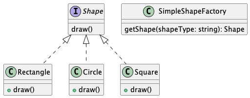

简单工厂模式不是一个正式的设计模式，但它是工厂模式的基础。
它使用一个单独的工厂类来创建不同的对象，根据传入的参数决定创建哪种类型的对象

工厂方法模式
1.工厂方法模式（Factory Method Pattern）
工厂方法模式定义了一个用于创建对象的接口，让子类决定实例化哪一个类。工厂方法使一个类的实例化延迟到其子类。

-- 概要
定义一个创建对象的接口，但让子类决定实例化哪一个类。工厂方法使一个类的实例化延迟到其子类。
-- 主要解决
创建对象需要大量重复的代码，或者需要创建的对象类型在运行时才能确定。
-- 如何解决
通过让子类实现工厂接口，返回一个抽象的产品

应用实例：
汽车制造：你需要一辆汽车，只需从工厂提货，而不需要关心汽车的制造过程及其内部实现。
Hibernate：更换数据库时，只需更改方言（Dialect）和数据库驱动（Driver），即可实现对不同数据库的切换。

-- 优点
调用者只需要知道对象的名称即可创建对象。
扩展性高，如果需要增加新产品，只需扩展一个工厂类即可。
屏蔽了产品的具体实现，调用者只关心产品的接口。

-- 缺点
1.每次增加一个产品时，都需要增加一个具体类和修改工厂，使得系统中类的个数成倍增加，在一定程度上增加了系统的复杂度，同时也增加了系统具体类的依赖。

-- 注意事项
工厂模式适用于生成复杂对象的场景。如果对象较为简单，通过 new 即可完成创建，则不必使用工厂模式。使用工厂模式会引入一个工厂类，增加系统复杂度。

-- 结构（工厂模式包括以下几个主要角色）
1.抽象产品（Abstract Product）：定义了产品的共同接口，可以是抽象类或接口。
2.具体产品（Concrete Product）：实现抽象产品接口，定义具体产品类。定义了具体产品的特定行为和属性
3.抽象工厂（Abstract Factory）：定义了创建抽象产品的接口，可以是抽象类或接口。
4.具体工厂（Concrete Factory）：实现抽象工厂接口，定义创建具体产品的具体方法。

实现：我们将创建一个 Shape 接口和实现 Shape 接口的实体类。下一步是定义工厂类 ShapeFactory。

FactoryPatternDemo 类使用 ShapeFactory 来获取 Shape 对象。它将向 ShapeFactory 传递信息（CIRCLE / RECTANGLE / SQUARE），以便获取它所需对象的类型。

---类图关系
（com/lucas/simpleFactory/simplefactory.puml）
